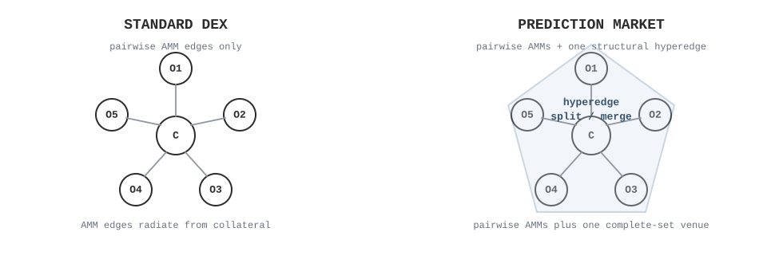

# Prediction Markets Need Hyperedges, Not Just Paths

Most onchain routing problems are described as pathfinding problems.

This is a good mental model for ordinary DEX routing. You have tokens as nodes, pools as edges, and you search for a good path from what you have to what you want. Even when the optimization is continuous under the hood, the picture is still basically graph-like.

Prediction markets quietly break this picture.

In a prediction market with mutually exclusive outcomes, there is usually a structural operation that is not a normal swap: you can mint a complete set, turning 1 unit of collateral into 1 unit of every outcome token, or merge a complete set back into collateral. In a binary market, this is the familiar operation "1 USDC becomes 1 YES + 1 NO", and the reverse. In an N-outcome market, it becomes "1 collateral becomes one share of every outcome".

That operation is not a pairwise edge. It touches every outcome token at once. So if we force ourselves to think only in terms of paths through a graph, we immediately start losing the shape of the problem.

The right abstraction is a hypergraph. Ordinary AMM swaps are still ordinary edges. But the complete-set mint/merge mechanism is a hyperedge: one operation that changes several assets at once. Once you model the market that way, the structural venue stops being a special-case heuristic and becomes a first-class part of routing.

This is the architecture we implemented in ForecastFlows, and it leads to a surprisingly simple routing engine.



*Ordinary DEX routing thinks in pairwise edges. Prediction markets add one operation that touches collateral and every outcome at once.*

## A 30-second example

Take a binary market with one collateral token and two outcomes, YES and NO.

Suppose the direct pools imply:

- buying 1 YES costs about `0.62`
- buying 1 NO costs about `0.45`
- minting a complete set costs exactly `1.00` collateral and gives `1 YES + 1 NO`

Now imagine you want YES.

A path-based router may look for the best direct way to buy YES. But a prediction-market-aware router should notice something structural: a complete set costs `1.00`, while the parts can be sold for `0.62 + 0.45 = 1.07`.

So there is a better synthetic route:

1. Mint `1 YES + 1 NO` for `1.00`.
2. Sell the unwanted NO for `0.45`.
3. End up with `1 YES` at an effective net cost of `0.55`.

That is already the whole story in miniature.

If the parts are worth more than the whole, mint and sell the extras. If the whole is worth more than the parts, buy the parts and merge them. The solver's job is to discover those structural trades automatically, alongside the ordinary AMM trades.

*The structural route is not a strange corner case. It is the basic prediction-market trade a good router needs to see.*

## The routing problem, from first principles

Suppose we have:

- one collateral asset, like USDC
- `N` mutually exclusive outcome tokens
- zero or more AMMs for each outcome against collateral
- one fee-free mint/merge mechanism for complete sets

We also have a portfolio: some collateral, maybe some existing outcome holdings, and a set of caller-supplied "fair values" for the outcomes. You can think of those fair values as your own marks or beliefs about what the outcomes are worth; they are inputs to the router, not something the solver tries to infer. The routing problem is to find the best set of trades, across all venues, that improves the portfolio according to those values without spending assets we do not have.

The key thing to notice is that there are two qualitatively different ways to get an outcome token:

1. Buy it directly from an AMM.
2. Mint a full basket of all outcomes, then sell the unwanted ones.

Likewise, there are two ways to sell an outcome:

1. Sell it directly into an AMM.
2. Buy the missing outcomes, assemble a complete set, and merge.

This is why naive route enumeration becomes awkward. A "route" is no longer just a sequence of pairwise swaps. It can include a basket transformation that changes several assets simultaneously.

At the smart contract level, the distinction is easy to see:

- a normal DEX route is a sequence of `swap()`-like calls
- a prediction-market route may also include a `split()` or `merge()` call on the complete-set mechanism

So the market topology has:

- one collateral node
- `N` outcome-token nodes
- ordinary pairwise AMM edges
- one complete-set hyperedge touching collateral and every outcome at once

That is the entire topology.

## Why a hyperedge is the correct abstraction

The key modeling move is this: do not define a venue by a path template. Define it by the trades it is willing to accept.

For an AMM, that means the set of baskets the pool will swap at its current reserves.

For a complete-set mechanism, that means the baskets consistent with:

- minting: spend collateral, receive one of every outcome
- merging: spend one of every outcome, receive collateral

This point matters because the complete-set operation is not a hack layered on top of routing. It is itself a venue with clean, well-defined behavior.

There is also one useful modeling detail: if a venue accepts some trade, it should also accept a strictly worse version of that trade where you give it more and ask for less. In trader language, you can always overpay. That simple rule is what keeps the structural venue easy to compose with the rest of the router.

For the split/merge venue, the exact trade is controlled by a single scalar `w`:

- `w > 0` means minting
- `w < 0` means merging
- `|w|` is the trade size
- `B` is a practical bound on that size

If you prefer a trader's sign table to vector notation, here it is:

| Operation | Collateral | Each outcome |
| --- | ---: | ---: |
| Mint 1 complete set | `-1` | `+1` |
| Merge 1 complete set | `+1` | `-1` |

In plain English: a valid trade is either an exact complete-set mint/merge, or an overpaying version of one. That is the mathematically clean hyperedge object for the fee-free structural venue.

## The core idea: replace route enumeration with price discovery

Instead of directly searching over all edge flows at once, the solver searches for a vector of internal prices, one per asset. You can think of them as the exchange rates that would make the whole network locally content.

Once you have candidate prices, each venue solves its own tiny local problem:

"At these prices, what trade would be most valuable for me to perform?"

If you dislike symbols, the important idea is just this: the solver proposes one global price vector, each venue sees only the prices relevant to itself, and each venue replies with the trade it would most like to do at those prices.

That is the powerful high-level concept here. The router is not enumerating handcrafted route templates. It is finding a set of internal prices under which each venue, acting locally, reveals one piece of the global optimum.

Each AMM only needs to answer a local arbitrage question against its own prices. The split/merge venue only needs to answer a local arbitrage question against the price of collateral and the prices of the outcome tokens. The global optimizer then adjusts the internal prices until the combination of all those local responses becomes globally consistent.

This is one of those ideas that feels almost too simple after you see it. The global route emerges from local profit maximization under the right shadow prices.

*The router does not guess routes directly. It proposes internal prices, asks each venue for its best local move, and reconciles the answers into one global route.*

## The split/merge oracle is almost embarrassingly simple

For the complete-set hyperedge, all the math collapses to one scalar question:

"Is the combined internal price of all the outcomes bigger than the internal price of one unit of collateral, or smaller?"

That means there are only three cases:

- if `sum(outcome_prices) > collateral_price`, mint at the bound
- if `sum(outcome_prices) < collateral_price`, merge at the bound
- if they are equal, there is no structural edge to exploit

In pseudocode, the complete-set oracle is basically:

```text
gap = sum(outcome_prices) - collateral_price
```

Then:

- if the gap is positive, mint
- if the gap is negative, merge
- if the gap is near zero, do nothing structural

That is not a heuristic. It is the exact economic test the complete-set venue should be performing.

*At the structural venue, the whole decision is: are the outcome prices heavier than the collateral price, lighter, or balanced?*

## Why this architecture is powerful

There is a tendency, especially in DeFi, to talk about "adding support for X" as if it means writing some routing if-statements. What is nice here is that the change is much cleaner than that.

This approach does not bolt prediction-market logic onto a swap router as an afterthought. It adds a new market geometry to a general routing engine.

That buys you a lot:

- direct AMM routes and structural mint/merge routes are optimized together
- the same framework works for binary markets and many-outcome markets
- multiple direct venues for one outcome fit naturally
- missing or thin direct venues are less fatal, because exposure can be synthesized through complete sets

There is also a practical engineering detail here. In theory, the complete-set mechanism is structural, so you might imagine leaving it unbounded. In practice, it is better to cap its trade size and expand that cap only if the optimizer is still leaning on it. That gives you a more stable solve and lets the engine fail closed instead of pretending a clipped route is trustworthy.

And when the market is exactly balanced, the engine still has to choose a concrete route decomposition and certify that it hangs together. That is a good example of the difference between "a neat equation" and "a production-grade routing engine."

## Why this is a better way to think about prediction-market routing

There is a deeper lesson here.

If we think of routing as path search, then the complete-set mechanism feels like a weird special case. If we think of routing as convex flow over trading sets, then the complete-set mechanism is almost boring. It is just another venue whose local arbitrage problem happens to have an especially nice closed form.

That shift in viewpoint matters.

It means:

- the solver does not need bespoke logic for "synthetic YES through mint and dump NO"
- direct pools and structural mint/merge are optimized in one unified objective
- the model scales naturally from binary markets to many outcomes
- the same decomposition idea works whether the direct venues are constant-product pools or concentrated-liquidity pools

And it gives a nice game-theoretic intuition too. Each venue is responding to the same vector of shadow prices. The global route is the fixed point where all of those local responses fit together into one consistent portfolio transformation.

That is exactly the kind of abstraction that tends to survive contact with reality.

## A note on scope

This architecture solves the routing problem, not the full execution problem.

It produces certified route plans: signed direct AMM trades, aggregate mint and merge amounts, final holdings, and certification metadata. Gas pricing, transaction construction, calldata packing, simulations, chain interaction, and safety policy still belong to the downstream driver.

That separation of concerns is the right one. The solver should be responsible for being mathematically honest about the optimization problem it solves, and the executor should be responsible for the messy real-world details of getting trades onto a chain safely.

## Closing thought

One of the recurring patterns in mechanism design and crypto is that a lot of things look combinatorial until you find the right convex object. Then the discrete-seeming complexity turns out to be a shadow cast by a much simpler geometry.

Prediction-market routing has this flavor.

The difficult part is not writing a longer list of route templates. The difficult part is using an abstraction that can express, in one language, both ordinary swaps and complete-set transformations. Hypergraphs do that. Convex-flow dual decomposition does that. And once those pieces are in place, the split/merge venue collapses to a one-line economic test:

"Are the parts worth more than the whole, or less?"

That is a very satisfying place to end up.
